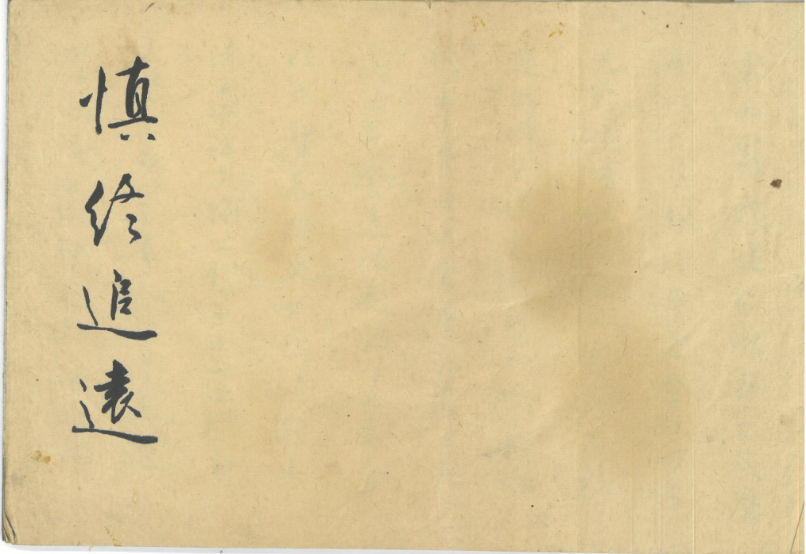

# 第 1 页 · 封面

> 由 `genealogy-transcribe` 技能（免 API：本地切列 + 代理逐列阅读）生成。

## 原件扫描

---

## 性质

家谱的**题词页（扉页）**——毛笔书法四字，竖排单行，**从上往下**读。
纸张泛黄、有水渍，为旧谱原件。

---

## 原文（连读·繁體）

> 标点为整理时所加。

慎終追遠

---

## 逐列原文

**第 1 列（单行四字）**　慎　終　追　遠

---

## 简体

慎终追远

---

## 白话大意

1. **慎终**：谨慎、郑重地办理长辈的丧葬之事。
2. **追远**：追念、祭祀已经去世的祖先。
3. 合意为：**不忘祖先、缅怀先人、重视家族传承**。
4. 出自《论语·学而》：「慎终追远，民德归厚矣。」——若人人慎重对待长辈后事、
   常追念祭祀祖先，社会风气便趋淳厚。
5. 作为家谱扉页题词，点明全谱宗旨：敬祖尊宗、追本溯源、传承家风、
   凝聚宗族；与序言 [[序]]、字辈 [[字辈排列]] 一脉相承。

---

## 信息一览

| 项目 | 内容 |
|------|------|
| 性质 | 题词页（扉页）书法 |
| 题词 | 慎終追遠（慎终追远） |
| 出处 | 《论语·学而》「慎终追远，民德归厚矣」 |
| 寓意 | 敬祖尊宗、饮水思源、传承家风 |
| 关联 | 东山翁氏家谱（见 [[序]]、[[字辈排列]]） |

---

> 转录说明：四字书法，字大清晰，辨识无歧义，未调用任何 LLM API。
> 与序言 [[序]]、字辈 [[字辈排列]] 相呼应。
