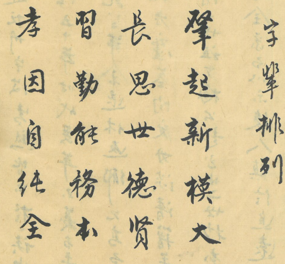

# 第 3 页 · 字辈排列

> 由 `genealogy-transcribe` 技能（免 API：本地切列 + 代理逐列阅读）生成。

## 原件扫描

---

## 性质

家谱的**字辈排列（派语 / 班辈字）**——规定后代各世取名所用的辈分字。
竖排，**从右往左、从上往下**阅读。最右一行为小字标题「**字輩排列**」，
其后四行为五言一句、共 **20 个辈分字**的派语。

---

## 原文（连读·繁體）

> `〔字〕`＝存疑或据上下文补入；`□`＝暂不能确认；标点为整理时所加。

**〔标题〕** 字輩排列

> 肇起新模大，長思世德賢，
> 習勤能格本，孝因〔自〕純全。

---

## 逐列原文（右起）

**第 1 列（标题·小字）**　字輩排列
**第 2 列**　肇　起　新　模　大
**第 3 列**　長　思　世　德　賢
**第 4 列**　習　勤　能　格　本
**第 5 列**　孝　因　〔自〕　純　全

---

## 简体

**字辈排列**

> 肇起新模大，长思世德贤，
> 习勤能格本，孝因〔自〕纯全。

---

## 白话大意

1. 这是东山翁氏（见 [[序]]）的**字辈谱**：从某世起，子孙按此 20 字逐代取名，
   第一代用「肇」、下一代用「起」，依次类推。
2. 内容是一首**五言四句的训勉派语**，寄望后代：开创新的宏大格局（肇起新模大）、
   长念世代德行与贤者（长思世德贤）、勤勉笃学以立根本（习勤能格本）、
   以孝为本而自然纯全（孝因自纯全）。
3. 与扉页 [[封面]]「慎终追远」、序言 [[序]] 的修谱宗旨一脉相承——
   既排定世系命名，又寓家训于其中。

---

## 信息一览

| 项目 | 内容 |
|------|------|
| 性质 | 字辈排列（派语 / 班辈字） |
| 字数 | 20 字（五言四句） |
| 派语 | 肇起新模大　長思世德賢　習勤能格本　孝因〔自〕純全 |
| 用途 | 规定后代逐世取名的辈分字 |
| 关联 | 东山翁氏家谱（见 [[序]]、[[封面]]） |

---

> 转录说明：本页字大、书体工整，辨识度高，未调用任何 LLM API。
> 仅第 5 列第 3 字（释作「自」）字形偏方、略存疑（或为「固/回」），余字较确。
> 如需 100% 精确，建议提供 300 dpi 以上清晰扫描件复核。与 [[封面]]、[[序]] 相呼应。
