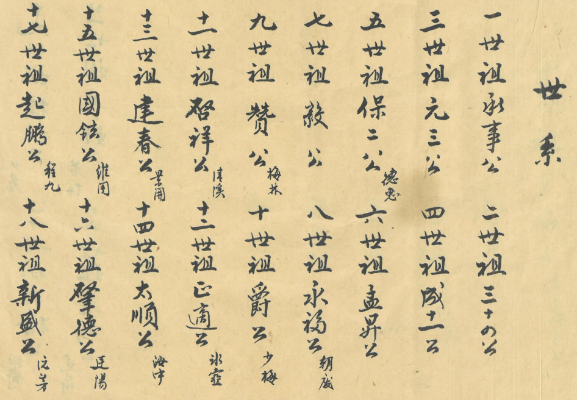

# 第 4 页 · 世系（一至十八世）

> 由 `genealogy-transcribe` 技能（免 API：本地切列 + 代理逐列阅读）生成。

## 原件扫描

---

## 性质

家谱的**世系录（祖先名录）**，竖排，**从右往左、从上往下**阅读。
标题「**世系**」。每列两位先祖，逐代记「**N世祖 〈名〉公**」，名旁常有**双行小字**
（字、号或行第小注）。本页收 **一世祖 至 十八世祖**（9 列 × 2 = 18 代）。

> ✅ 名讳已**人工对照原件核对**；仅余三处小注存疑（十四「〔海寧〕」、十五「〔維周〕」、
> 十八「〔泛芳〕」）。`〔〕`＝存疑。

---

## 世系表

| 世 | 名讳 | 字号·小注 |
|----|------|-----------|
| 一世祖 | 承事公 | （始祖；疑「承事郎」之称，见 [[序]]） |
| 二世祖 | 三十四公 | （行第名） |
| 三世祖 | 元三公 | |
| 四世祖 | 成十一公 | |
| 五世祖 | 保二公 | 德惠 |
| 六世祖 | 孟昇公 | |
| 七世祖 | 毅公 | |
| 八世祖 | 永福公 | 朔龐 |
| 九世祖 | 贊公 | 梅林 |
| 十世祖 | 爵公 | 少梅 |
| 十一世祖 | 啟祥公 | 佳溪 |
| 十二世祖 | 正謫公 | 冰壺 |
| 十三世祖 | 逢春公 | 墨齋 |
| 十四世祖 | 大順公 | 〔海寧〕 |
| 十五世祖 | 國鉉公 | 〔維周〕 |
| 十六世祖 | 肇德公 | 廷陽（字辈「肇」） |
| 十七世祖 | 起鵬公 | 程九（字辈「起」） |
| 十八世祖 | 新盛公 | 〔泛芳〕（字辈「新」） |

---

## 逐列原文（右起，每列两代）

**第 1 列**　一世祖承事公　二世祖三十四公
**第 2 列**　三世祖元三公　四世祖成十一公
**第 3 列**　五世祖保二公　德惠　六世祖孟昇公
**第 4 列**　七世祖毅公　八世祖永福公　朔龐
**第 5 列**　九世祖贊公　梅林　十世祖爵公　少梅
**第 6 列**　十一世祖啟祥公　佳溪　十二世祖正謫公　冰壺
**第 7 列**　十三世祖逢春公　墨齋　十四世祖大順公　〔海寧〕
**第 8 列**　十五世祖國鉉公　〔維周〕　十六世祖肇德公　廷陽
**第 9 列**　十七世祖起鵬公　程九　十八世祖新盛公　〔泛芳〕

---

## 白话大意

1. 本页是**东山翁氏的世系名录**，按代记录一至十八世祖的名讳与小注，
   接续 [[序]] 所述「自〔十〕世祖梅公起、至廿世」的世系。
2. **一世祖即承事公**（疑为「承事郎」官称）——与 [[序]] 互证；
   据原件人工核对，已将 [[序]] 中始祖名「衛事」**订正为「承事」**。
3. 前期（约一至十五世）多用行第 / 单名（如二世「三十四公」、四世「成十一公」、七世「毅公」），
   **自十六世起依 [[字辈排列]] 派语取名**：十六「肇」德、十七「起」鵬、十八「新」盛，
   正是派语「肇起新……」的前三字——可据此校正后续世序。

---

## 信息一览

| 项目 | 内容 |
|------|------|
| 性质 | 世系录（祖先名录） |
| 收录世代 | 一世祖 ～ 十八世祖（18 代） |
| 始祖 | 承事公（疑「承事郎」官称，见 [[序]]） |
| 字辈起点 | **第 16 世**起用 [[字辈排列]]（肇→起→新…） |
| 关联 | [[序]]、[[字辈排列]]、[[世系-十九至廿二世]] |

---

> 转录说明：**未调用任何 LLM API**；全页名讳已**人工对照原件核对确认**。
> 据此订正：始祖「衛事」→「**承事**」（同步改 [[序]]）；末列两代由 17 / 18 世厘正。
> 仅余三处小注存疑：十四「〔海寧〕」、十五「〔維周〕」、十八「〔泛芳〕」。
> 与 [[序]]、[[字辈排列]]、[[世系-十九至廿二世]] 相呼应。
