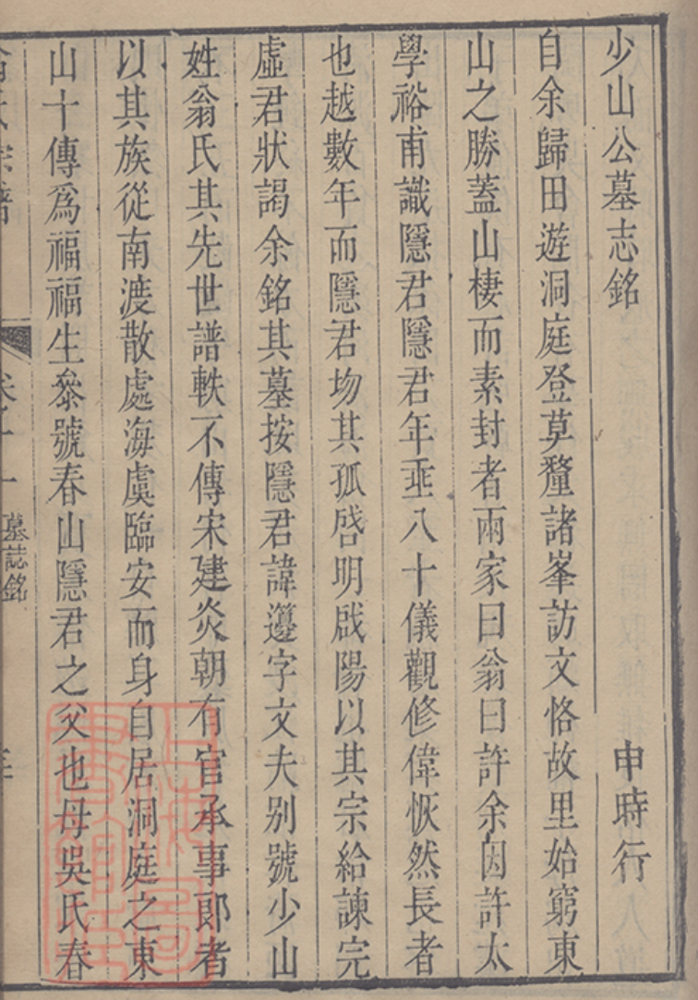
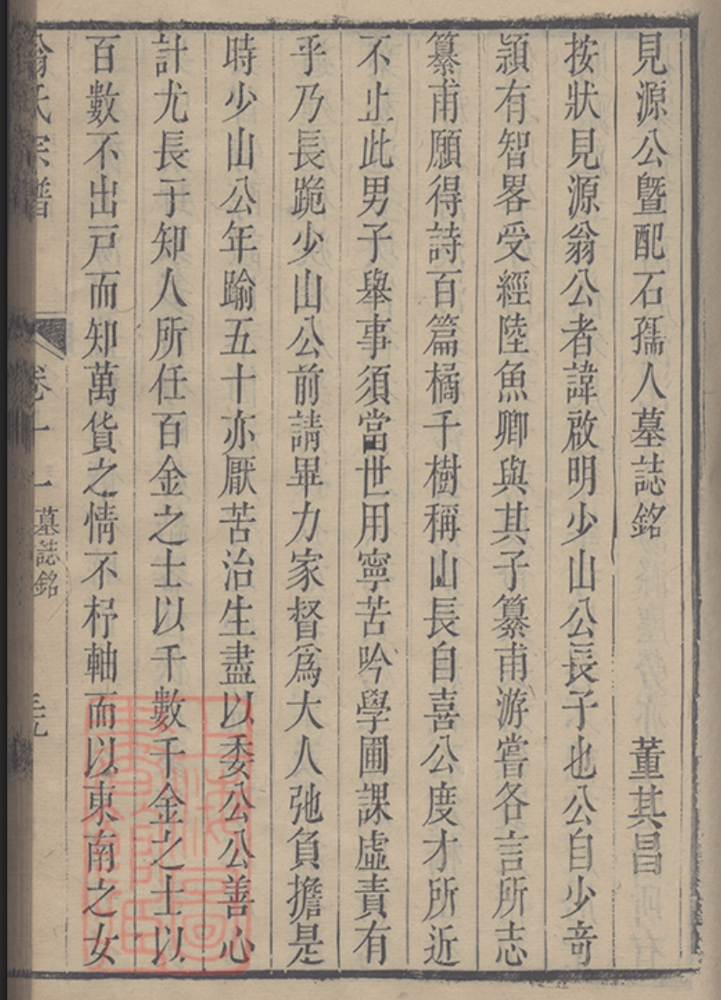
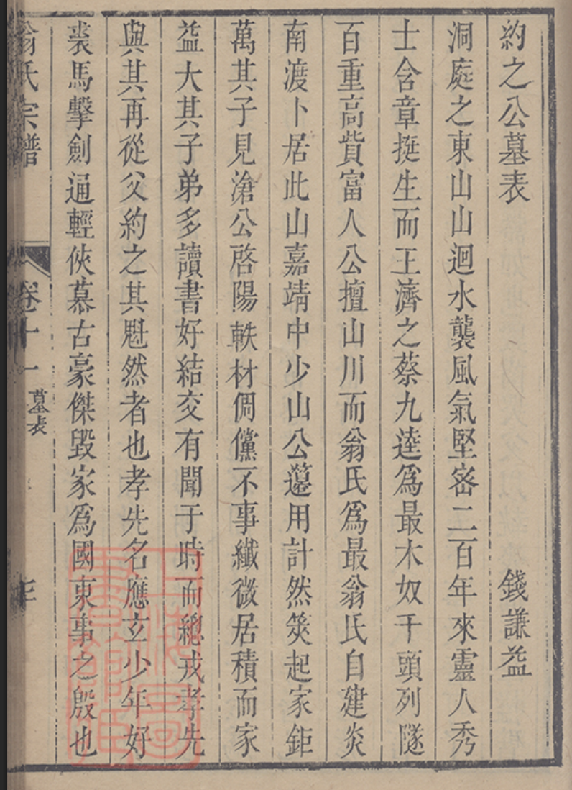
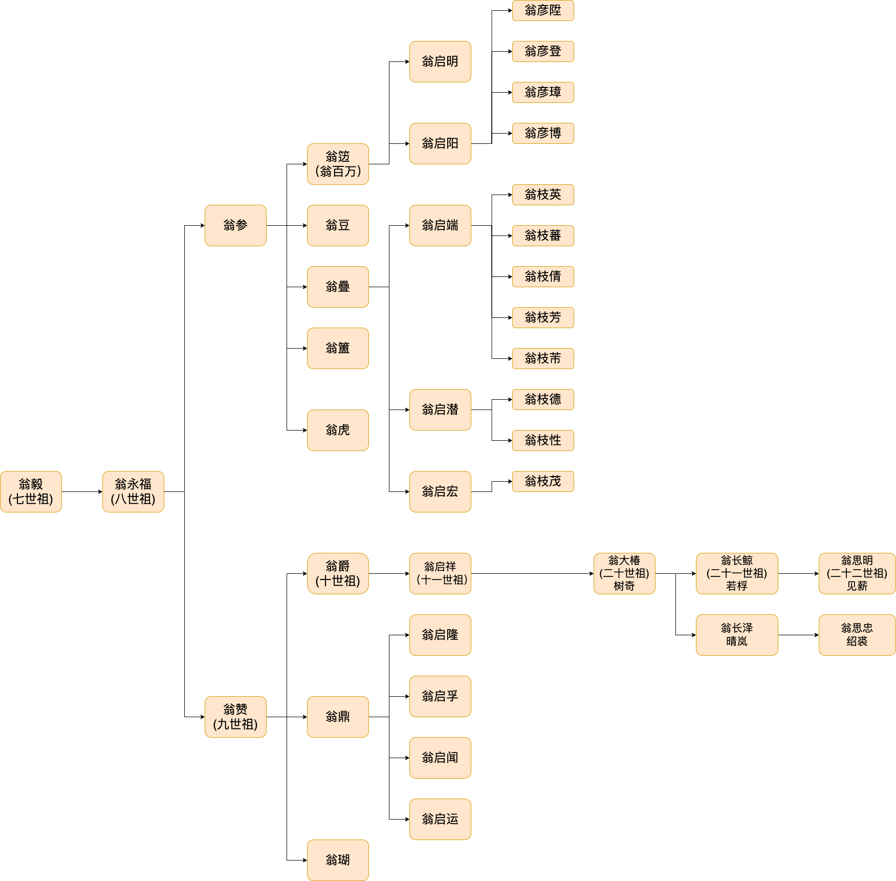

# 人物传 · 名贤墓志铭（卷十一）

> 出自 1765 刻本 **卷十一「傳誌詩跋之類」**（page_1566 起）。本卷收明清名贤为
> **东山翁氏** 先人所撰**墓志铭 / 墓表**——撰者皆当朝重臣、文坛巨子，足证此族
> 在明代「洞庭商帮」中的地位（翁籩即 **翁百萬**）。
> 本页为**高层汇总**（撰者 ↔ 谱主 ↔ 世代），各篇正文待后续逐页转录。

## 谱中称呼 ↔ 实际姓名（对照表）

| 谱中称呼 | 实际姓名 | 世代 | 在世系中的位置 |
|----------|----------|------|----------------|
| 少山公 | **翁籩**（即 **翁百萬**） | 10 世 | 翁參之子（翁參＝9 世） |
| 見源公 | **翁啟明** | 11 世 | 翁籩长子 |
| 見滄公 | **翁啟陽** | 11 世 | 翁籩次子 |
| 約之公 | **尚待确认**（疑 **翁彥博** 这一代） | 12 世 | 翁啟明之子一辈 |

> 称呼为「号」，实际姓名据[家谱世系图](#家谱世系图参考)与用户考订；约之公的本名待核。

---

## 谁为谁作墓志铭（高层汇总）

| # | 文体 | 谱主（号 → 本名 · 世代） | 撰者 | 撰者身份 |
|---|------|--------------------------|------|----------|
| ① | 墓誌銘 | 少山公 → **翁籩（翁百萬）** · 10 世 | **申時行**（1535–1614） | 明·嘉靖状元，万历朝**内阁首辅**，太子太师·吏部尚书·中极殿大学士 |
| ② | 墓誌銘（曁配石孺人） | 見源公 → **翁啟明** · 11 世 | **董其昌**（1555–1636） | 明·**礼部尚书**，书画宗师，谥文敏 |
| ③ | 墓表 | 約之公 → 〔待考·12 世〕 | **錢謙益**（1582–1664） | 明末清初·**礼部侍郎**，虞山诗派领袖，文坛巨擘 |

> 三篇原件首页见下方 **原件扫描（逐篇）** ①②③。

**一句话**：三篇墓铭恰成**世代与年代的对应链**——
申時行（生 1535）为 **10 世** 少山公作铭 → 董其昌（生 1555）为 **11 世** 見源公作铭 →
錢謙益（生 1582）为 **12 世** 約之公作表，撰者一代晚于一代，谱主亦逐代下延，内证一致。

---

## 原件扫描（逐篇）

> 各篇墓铭原件首页（1765 刻本，雕版印本）。每篇正文多页，此处仅首页；全文待后续转录。

### ① 少山公（翁籩／翁百萬，10 世）墓誌銘 — 申時行 撰

### ② 見源公（翁啟明，11 世）曁配石孺人墓誌銘 — 董其昌 撰

### ③ 約之公（待考，12 世）墓表 — 錢謙益 撰

> 開篇為錢謙益典型筆法：「洞庭之東山，山迴水襲，風氣……」，諱名在正文中段，**待核**。

---

## 家谱世系图（参考）

用户整理的世系图，统摄本卷诸公的位置（自 7 世翁毅起）：

要点：
- **主干**：翁毅(7) → 翁永福(8) → 翁參 / **翁贊(9)**。
- **翁參一支**：→ **翁籩（翁百萬，少山公，10）** → 翁啟明（見源，11）/ 翁啟陽（見滄，11）
  → 翁彥陞·彥登·彥璋·**彥博**（12，約之公一代）。
- **翁贊一支**：→ **翁爵（10，少梅/梅公）** → 翁啟祥(11) → …（中略）… → **翁大椿(20·树奇)**
  → 翁長鯨(21·若桴)/翁長澤(21·晴岚) → 翁思明(22·見薪)/翁思忠(紹裘)。
  —— **此即 1982 抄本所续之线**（[[世系-一至十八世]]、[[世系-十九至廿二世]]：自 10 世爵公至 22 世）。

> 故 1765 刻本与 1982 抄本在 **10 世（翁爵/梅公）** 处对接：刻本详记 6–15 世各支，
> 抄本接续 10–22 世单线。两本互证见 [总目录](../../目录.md)。

---

## 信息一览

| 项目 | 内容 |
|------|------|
| 出处 | 卷十一「傳誌詩跋之類」（page_1566 起） |
| 收录 | 名贤所撰墓志铭 / 墓表（本批 3 篇） |
| 谱主 | 翁籩(10)、翁啟明(11)、约之公(12·待考) |
| 撰者 | 申時行、董其昌、錢謙益（明～明清之际三大名臣/文宗） |
| 家族标签 | 翁百萬（洞庭东山富商，洞庭商帮） |
| 待办 | ① 约之公本名核实；② 三篇墓铭正文逐页转录；③ 见滄公(翁啟陽)墓铭若有另页 |

---

> 转录说明：本页为**高层汇总**，未转录墓铭正文；撰者/谱主据标题页与世系图判定，
> **未调用任何 LLM API**。约之公本名、各篇正文待后续补全。与 [[目录-1765]]、[[世系-一至十八世]] 相呼应。
