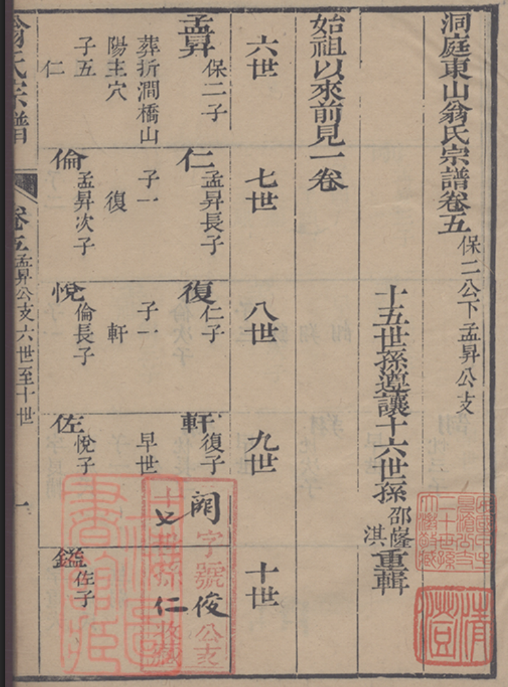

# 卷五 · 世系图（保二公下孟昇公支，六至十世）〔pilot〕

> 由 `genealogy-transcribe` 技能（免 API：本地切列 + 代理逐列阅读）生成。
> **底本**：洞庭东山翁氏宗谱 1765 刻本。本页为**世系图（吊线图）**试做样张，
> 用于确定「世-列表格」格式，**下游低世代分支尚需再切图复核**。

## 原件扫描

---

## 性质

雕版印本**世系图（吊线图）**。与抄本的「逐代单列名录」不同，本页是**二维谱系**：

- **每一竖列＝一条父子直系**（自上而下：祖→子→孙），名旁双行小字记
  「**X長子/次子**」（父系）、「**子N**」（子嗣数）、葬地/字号/早世等。
- 另有一**「世」标尺列**（六世·七世·八世…自上而下），用于把同高度的名字对到对应世代。
- 卷端注「〔始祖以來前見一卷〕」——一至五世见前卷。

**支系**：保二公（五世）下 **孟昇公（六世）** 一支。落款「十五世孫鳳廷甫重輯」。

> ⚠️ 置信：上半（孟昇→仁→復→軒 主干，六~九世）较清晰；**十世及孟昇次子(倫)以下**
> 字口漫漶，多处 `〔〕`/`□`，待**单独再切图放大**复核。

---

## 世系表（世 · 名 · 父 · 小注）

| 世 | 名 | 父 | 小注 |
|----|----|----|------|
| 六世 | 孟昇 | 保二（公） | 保二公之子；葬折澗橋山；下分數子 |
| 七世 | 仁 | 孟昇 | 孟昇**長子**；子一 |
| 七世 | 〔倫〕 | 孟昇 | 孟昇**次子**；〔子五〕 |
| 八世 | 復 | 仁 | 仁子；子一 |
| 八世 | 〔寬〕 | 〔倫〕 | 倫長子〔待核〕 |
| 〔九〕世 | 〔悅〕 | 〔寬〕 | 倫支沿線；字漫漶 |
| 九世 | 軒 | 復 | 復子；**早世** |
| 〔十〕世 | 〔佐〕 | 〔悅〕 | 悅子（倫支） |
| 十世 | 〔閬〕 | 〔軒〕 | □ 名待核（軒之子） |
| 〔十〕世 | 〔藍〕 | 〔佐〕 | 佐子（倫支） |
| 十世 | 〔俊〕公 | □ | □ 小字漫漶，待核 |

> 表中 `〔〕`＝形近/漫漶存疑，`□`＝暂不能确认。**孟昇次子(倫)支及十世**整体为低置信，
> 仅列出可辨字，**不臆补**。

---

## 逐列原文（右起，含置信标记）

**col02（卷端）**　洞庭東山翁氏宗譜卷五　保二公下孟昇公支〔印·十五世孫鳳廷甫重輯〕
**col04**　〔始祖以來前見一卷〕（一至五世見前卷）
**col05（世标尺）**　六世　七世　八世〔…〕
**col06（主干直系）**　孟昇　保二子　葬折澗橋山｜仁　孟昇長子　子一｜復　仁子　子一｜軒　復子　早世｜〔閬…俊公…〕
**col07（小注）**　〔…陽未穴〕｜子一｜復｜子一｜軒
**col08（孟昇次子支）**　子五｜〔倫〕　孟昇次子｜〔寬〕　倫長子｜〔悅〕｜〔佐〕悅子｜〔藍〕佐子
**col09（左缘·页题）**　六世至十世（本页世代范围）｜軒〔…〕

---

## 白话大意

1. 本页是 1765 刻本**卷五**的**世系图**，专记 **保二公（五世）之子 孟昇公（六世）** 一支，
   排至约**十世**；一至五世在前卷（卷端注「始祖以來前見一卷」）。
2. 读法是**吊线图**：竖看是一条**父子直系**（孟昇 → 长子仁 → 復 → 軒…），
   名旁小字注明「某之长子/次子」和「子几」（有几个儿子），并记葬地、早卒等。
3. 已确认主干：**六世孟昇（保二公子，葬折澗橋山）→ 七世仁（长子）→ 八世復 → 九世軒（早卒）**；
   孟昇另有**次子〔倫〕**一支（〔子五〕），及**十世**若干，因字口漫漶**暂存疑**。
4. 与 [[目录-1765]] 卷五（保一公下傑公世系→孟昇公世系）对应；孟昇公亦见
   1982 抄本 [[世系-一至十八世]]（六世祖孟昇公）——**两本同指一人**，可互证。

---

## 信息一览

| 项目 | 内容 |
|------|------|
| 性质 | 世系图（吊线图） |
| 卷次 | 卷五 |
| 支系 | 保二公下孟昇公支 |
| 收录世代 | 六世 ～ 十世（本页） |
| 支祖 | 孟昇（六世，保二公之子，葬折澗橋山） |
| 重辑人 | 十五世孫 鳳廷甫 |
| 互证 | [[世系-一至十八世]]（六世祖孟昇公）、[[目录-1765]] |
| 待核 | 孟昇次子(倫)支、十世各名（建议再切图放大） |

---

> 转录说明：**未调用任何 LLM API**。世系图主干（六~九世）置信较高；
> **孟昇次子支与十世**字口漫漶，已逐处以 `〔〕`/`□` 标注，**未臆补**。
> 建议对左半（col08/09）单独 300dpi 再切图复核。与 [[目录-1765]]、[[世系-一至十八世]] 相呼应。
