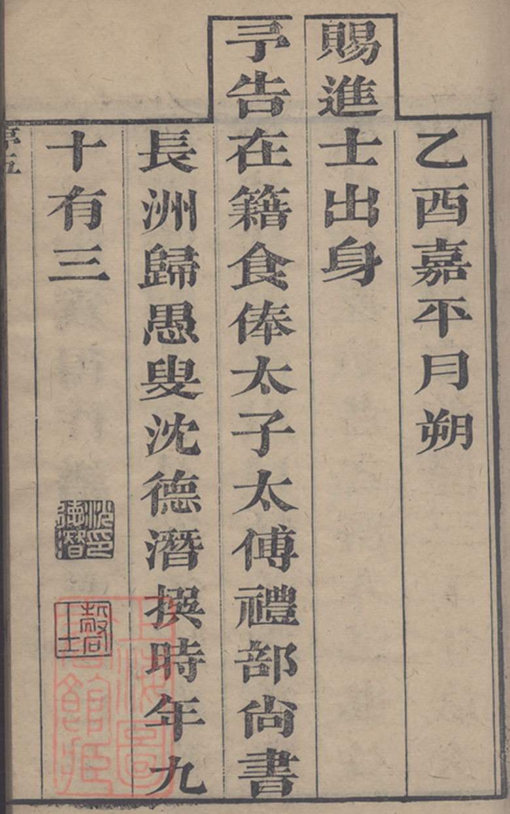

# 卷首 · 新序（沈德潛）落款页

> 由 `genealogy-transcribe` 技能（免 API：本地切列 + 代理逐列阅读）生成。
> **底本**：洞庭東山翁氏宗譜，乾隆三十年乙酉（1765）刻本（木刻**印本**，非手写）。

## 原件扫描

---

## 性质

本谱 **卷首「新序」** 的**落款（署名）页**，竖排雕版印本，**从右往左、从上往下**读。
正文（序文本体）应在此页之前，**本批扫描未含**，此页仅存序末的**作者衔名、撰序时间与钤印**。

撰序者为 **沈德潛**（1673–1769），字确士，号**归愚**，江苏**长洲**人，
清乾隆朝重臣、著名诗人与选家。此序证实本谱刻于 **乾隆三十年乙酉（1765）**。

---

## 原文（连读·繁體）

> 标点为整理时所加；`〔字〕`＝据字形/史实校补，`□`＝暂不能确认。

乙酉嘉平月朔。賜進士出身、尋告在籍食俸、太子太傅禮部尚書，長洲歸愚沈德潛撰，時年九十有三。〔鈐印二〕

---

## 逐列原文（右起，含置信标记）

> 第 1/3/5 列为雕版**界栏（黑线）**，无字；内容列如下。

**乙酉嘉平月朔**　（撰序时间：乾隆三十年十二月初一）
**賜進士出身**　（衔名一）
**尋告在籍食俸**　**太子太傅禮部尚書**　（衔名二、三）
**長洲歸愚沈德潛撰時年九**
**十有〔三〕**　＋　**钤印二方**

---

## 简体

乙酉腊月初一。赐进士出身、寻告在籍食俸、太子太傅礼部尚书，长洲归愚沈德潜撰，时年九十有三。〔钤印二方〕

---

## 白话大意

1. 这是本谱**卷首「新序」的落款页**——序文正文不在本批扫描中，此页只剩署名与日期。
2. 撰序人是 **沈德潜**（号**归愚**，江苏**长洲**人），列出其官衔：
   **赐进士出身**、（曾告老）**在籍食俸**、**太子太傅·礼部尚书**。
3. 落款时间 **「乙酉嘉平月朔」＝乾隆三十年（1765）十二月初一**，
   故本谱刻成于 **1765 年**，与书名页「乾隆三十年刻本」相合。
4. 「**撰时年九十有三**」——沈德潜生于 1673 年，乙酉年虚岁正 93，史实吻合，
   可反证「三」字（原刻末字略漫漶，据此定为「三」）。
5. 页末有 **两方钤印**（应为沈氏名号印），是其亲撰／签署的物证。

---

## 信息一览

| 项目 | 内容 |
|------|------|
| 性质 | 卷首「新序」落款页（序正文未在本批扫描） |
| 撰序人 | 沈德潛（号归愚，长洲人，1673–1769） |
| 衔名 | 赐进士出身 · 尋告在籍食俸 · 太子太傅 · 礼部尚书 |
| 撰序时间 | 乙酉嘉平月朔＝乾隆三十年（1765）腊月初一 |
| 撰序时年龄 | 九十有三（虚岁 93，与生年 1673 吻合） |
| 钤印 | 两方（名号印） |
| 关联 | [[目录-1765]]、卷首另有「原序」「續修引」「凡例」 |

---

> 转录说明：**未调用任何 LLM API**；雕版印本字口清晰，本页衔名/纪年均高置信。
> 仅末字「九十有〔三〕」原刻略漫漶，据沈德潛生年（1673）反推虚岁 93 定为「三」。
> 序文**本体不在本批扫描**；如后续提供新序正文各页，可补全。与 [[目录-1765]] 相呼应。
