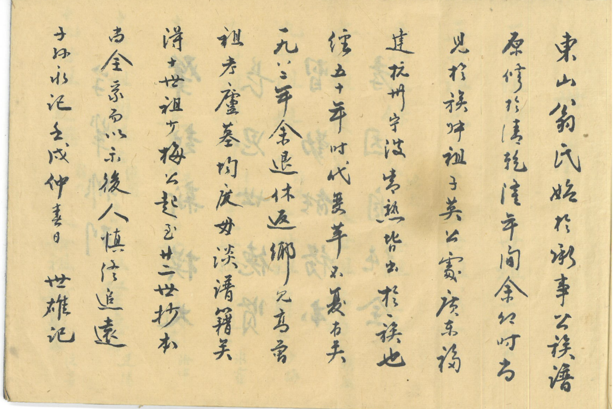

# 第 2 页 · 序

> 由 `genealogy-transcribe` 技能（免 API：本地切列 + 代理逐列阅读）生成。

## 原件扫描

---

## 性质

家谱的**序言（序）**，竖排手写行书，**从右往左、从上往下**阅读。
末尾落款 **「壬戌仲春日，世雄记」**，即 **公元 1982 年**春所撰。

---

## 原文（连读·繁體）

> `〔字〕`＝存疑或据上下文补入；`□`＝暂不能确认；标点为整理时所加。

東山翁氏，始於承事公。族譜原修於清乾隆年間，余幼見於族叔祖子英公，〔寄〕廣東揭〔陽〕、〔福〕建、杭州、寧波……皆出於〔一〕族也。歷五十年，時代變〔遷〕，……不復有矣。一九八二年，余退休返鄉，見祖考廬墓均〔廢〕，□□譜□矣。自〔十〕世祖梅公起，至廿世，抄本〔尚〕全錄而以示後人，慎終追遠。

**落款**：子孫永記。壬戌仲春日，世雄記。

---

## 逐列原文（右起，含置信标记）

**第 1 列**　東山翁氏始於承事公族譜
**第 2 列**　原修於清乾隆年間，余幼
**第 3 列**　見於族叔祖子英公，〔寄〕廣東揭〔陽〕
**第 4 列**　〔福〕建、杭州、寧波……皆出於〔一〕族也
**第 5 列**　歷五十年，時代變〔遷〕……不復有矣
**第 6 列**　一九八二年，余退休返鄉，見
**第 7 列**　祖考廬墓均〔廢〕，□□譜□矣
**第 8 列**　自〔十〕世祖梅公起，至廿世，抄本
**第 9 列**　〔尚〕全錄而以示後人，慎終追遠
**第 10 列**　子孫永記。壬戌仲春日，世雄記。

---

## 简体

东山翁氏，始于承事公。族谱原修于清乾隆年间，余幼时见于族叔祖子英公处，
〔寄居〕广东揭〔阳〕、〔福〕建、杭州、宁波……皆出于〔同〕一族也。历五十年，
时代变〔迁〕，……不复有矣。一九八二年，余退休返乡，见祖考庐墓均〔废〕，
□□谱□矣。自〔十〕世祖梅公起，至廿世，抄本〔尚〕全录而以示后人，慎终追远。
子孙永记。壬戌仲春日，世雄记。

---

## 白话大意

1. **源流**：东山**翁氏**一族，始祖为**承事公**（疑「承事郎」官称，即 [[世系-一至十八世]] 一世祖）；旧族谱**最早修于清·乾隆年间**。
2. **见闻**：撰序人（世雄）幼年时，曾在族叔祖**子英公**处见过这部老谱。
3. **散居**：族人分布于**广东揭阳、福建、杭州、宁波**等地，但**皆出于同一宗族**。
4. **失修**：历经约五十年世事变迁，旧谱几近散失，**祖坟庐墓也多荒废**。
5. **重修**：**1982 年（壬戌）作者退休返乡**，遂据**抄本**重新整理，
   收录**自〔十〕世祖梅公起、至二十世**的世系。
6. **宗旨**：完整记录以示后人，呼应扉页 [[封面]]「慎终追远」之意，并嘱**子孙永记**。

---

## 信息一览

| 项目 | 内容 |
|------|------|
| 家族 | 东山**翁氏** |
| 始祖 | 承事公（疑「承事郎」官称；据 [[世系-一至十八世]] 一世祖订正） |
| 旧谱初修 | 清·乾隆年间 |
| 散居地 | 广东揭阳、福建、杭州、宁波等 |
| 重修缘起 | 旧谱散失、祖墓荒废 |
| 重修时间 | 1982 年（壬戌）仲春 |
| 撰序/重修人 | 世雄（「世」字辈） |
| 收录世系 | 自〔十〕世祖梅公 → 二十世 |

---

> 转录说明：本页由本地切列（10 列，右→左）+ 代理逐列阅读完成，**未调用任何 LLM API**。
> 仍存疑处：第 4 列开头地名、第 5/7 列中段数字。
> （始祖名原作「衛事」，已据 [[世系-一至十八世]] 一世祖**订正为「承事公」**。）
> 如需 100% 精确原文，建议提供 300 dpi 以上清晰扫描件再校。与扉页 [[封面]]、字辈 [[字辈排列]] 相呼应。
