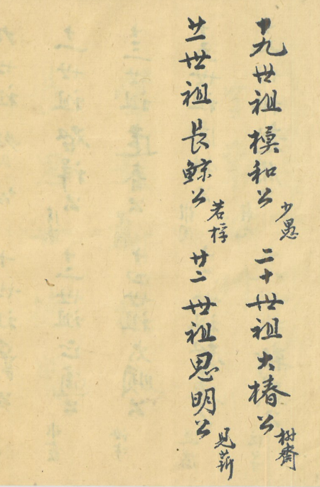

# 第 5 页 · 世系（十九至廿二世）

> 由 `genealogy-transcribe` 技能（免 API：本地切列 + 代理逐列阅读）生成。

## 原件扫描

---

## 性质

[[世系-一至十八世]] 的续页。竖排，**从右往左、从上往下**，每列两位先祖，
记「**N世祖 〈名〉公**」并附**双行小字**。本页清晰内容为 **十九世祖 至 廿二世祖**。

> ⚠️ 本页为**蓝色淡墨**手写，扫描偏淡；右侧两列较清，左侧另有淡影（见下）。

---

## 世系表

| 世 | 名讳 | 字号·小注 |
|----|------|-----------|
| 十九世祖 | 模和公 | 少愚（字辈「模」） |
| 二十世祖 | 大椿公 | 樹齋（字辈「大」） |
| 廿一世祖 | 長鯨公 | 若梓（字辈「長」） |
| 廿二世祖 | 思明公 | 見薪（字辈「思」） |

字辈接续 [[字辈排列]]「肇起新**模大**　**長思**世德賢」——十九～廿二世正用「模大長思」，
与 [[世系-一至十八世]] 第 16 世起的派字命名一脉相承，可据此校正世序。

---

## 逐列原文（右起，每列两代）

**第 1 列**　十九世祖模和公　少愚　二十世祖大椿公　樹齋
**第 2 列**　廿一世祖長鯨公　若梓　廿二世祖思明公　見薪

---

## 白话大意

1. 续记东山翁氏 **十九至廿二世** 先祖名讳，名字依 [[字辈排列]] 派语取字：
   十九「模」、二十「大」、廿一「長」、廿二「思」。
2. 接 [[世系-一至十八世]]；序言 [[序]] 称收录「至廿世」，本页已及廿二世，
   或为后续补录。

---

## 信息一览

| 项目 | 内容 |
|------|------|
| 性质 | 世系录（续页） |
| 收录世代 | 十九世祖 ～ 廿二世祖（人工核对确认） |
| 字辈 | 模 / 大 / 長 / 思（[[字辈排列]] 第 4–7 字） |
| 关联 | [[世系-一至十八世]]、[[字辈排列]]、[[序]] |

---

> 转录说明：**未调用任何 LLM API**。四代名讳与字号小注均经**人工对照原件核对确认**
> （十九 模和·少愚／二十 大椿·樹齋／廿一 長鯨·若梓／廿二 思明·見薪），并与 [[字辈排列]] 派字相符。
> **左侧淡影经处理（灰度/红通道增强）辨为页四内容的「透印 / 背透」**（如「逢春」「大順」「世祖」字样），
> 判为**邻叶透印、非本页新条目**，故未录入。
> 与 [[世系-一至十八世]]、[[字辈排列]]、[[序]] 相呼应。
